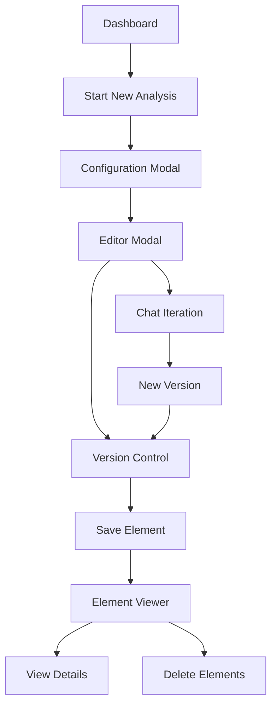
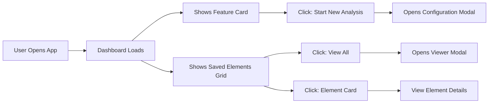
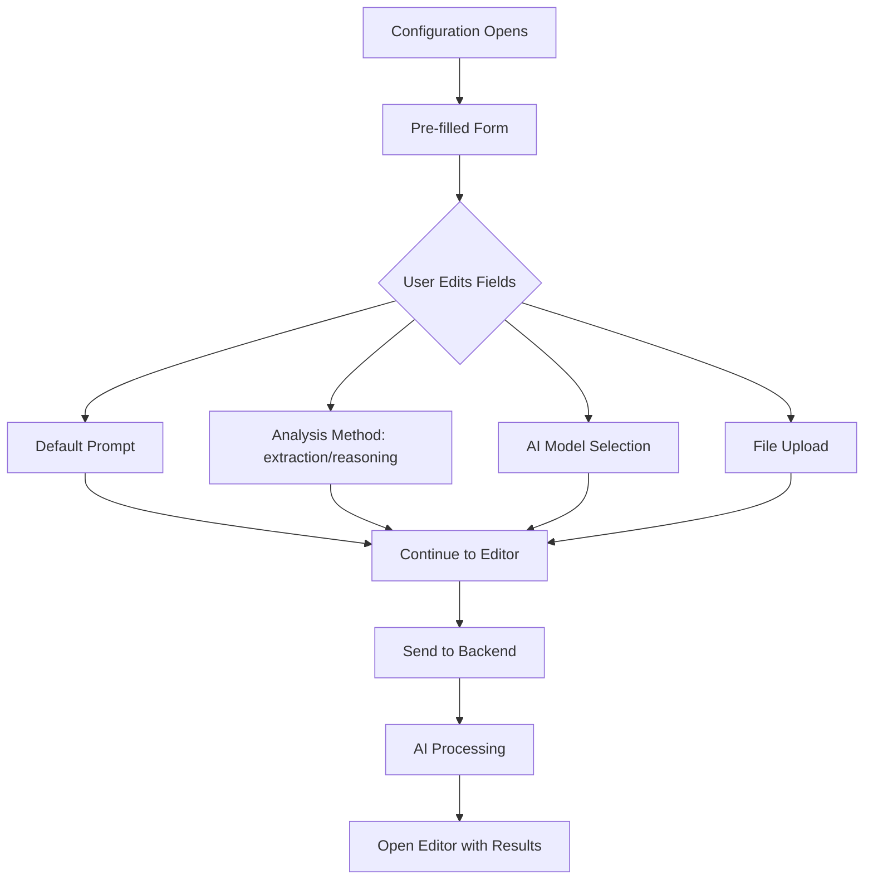
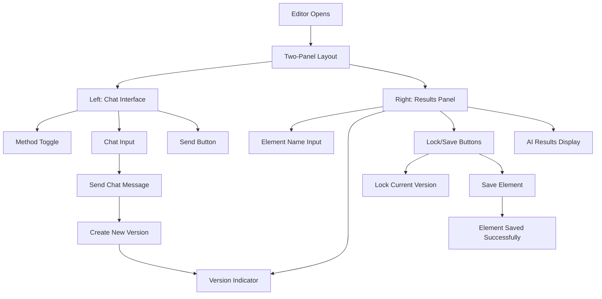
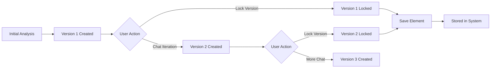
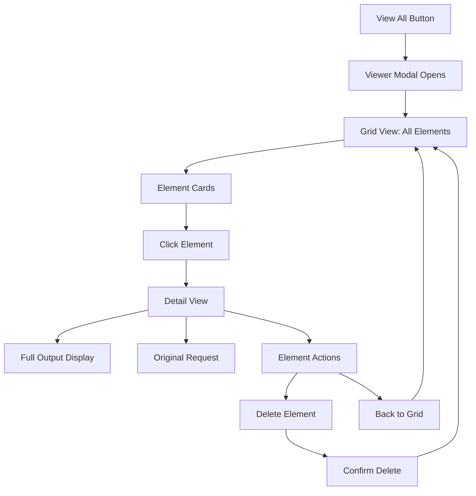
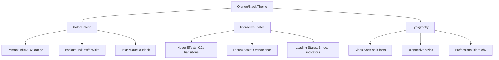
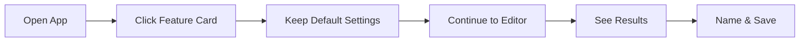
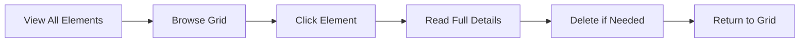

# 🎨 UI Functionality Overview

## System Flow: Complete User Journey



---

## 🏠 Main Dashboard Flow



**Dashboard Components:**
- **Header**: Orange gradient title with system description
- **Feature Card**: Large clickable card to start analysis
- **Saved Elements**: Grid showing previously saved analyses
- **Actions**: View All and Refresh buttons

---

## ⚙️ Configuration Modal Flow



**Form Fields:**
- **Default Prompt**: Large textarea with example prompt
- **Analysis Method**: Dropdown (extraction/reasoning)
- **AI Model**: Dropdown (gpt-4o, gpt-4o-mini, o1-preview, o1-mini)
- **File Upload**: Drag & drop with `test.txt` pre-selected

---

## 📝 Editor Modal Flow



**Key Features:**
- **Split Layout**: Chat on left, results on right
- **Version Control**: Lock versions, create new versions via chat
- **Element Naming**: Custom names with smart defaults
- **Real-time Updates**: Results update as you interact

---

## 🔄 Version Control Flow



**Version Features:**
- **Auto-numbering**: V1, V2, V3... as you iterate
- **Locking System**: Lock versions to preserve them
- **Save Flexibility**: Can save any version (locked or unlocked)
- **Smart Defaults**: Version 1 selected if no locking done

---

## 👁️ Element Viewer Flow



**Viewer Components:**
- **Grid Layout**: Responsive cards showing element previews
- **Detail View**: Complete output with metadata
- **Actions**: Delete elements, navigate back
- **Search**: Quick filtering of saved elements

---

## 🎨 Design System



**Design Principles:**
- **Clean Interface**: No icons or emojis, text-based
- **Professional Look**: Orange accents on white/black
- **Smooth Interactions**: Hover effects and transitions
- **Accessible**: High contrast, keyboard navigation
- **Responsive**: Works on desktop and mobile

---

## 💡 Key User Flows

### **Quick Analysis Flow**


### **Iterative Analysis Flow**
```mermaid
graph LR
    A[Get Initial Results] --> B[Chat: "Also show Germany"]
    B --> C[New Version Created]
    C --> D[Chat: "Summarize trends"]
    D --> E[Version 3 Created]
    E --> F[Lock & Save Best Version]
```

### **Element Management Flow**


The UI provides a complete workflow from initial analysis through iterative refinement to permanent storage and management of results.