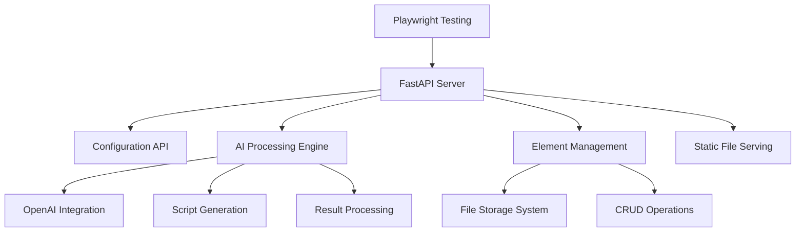
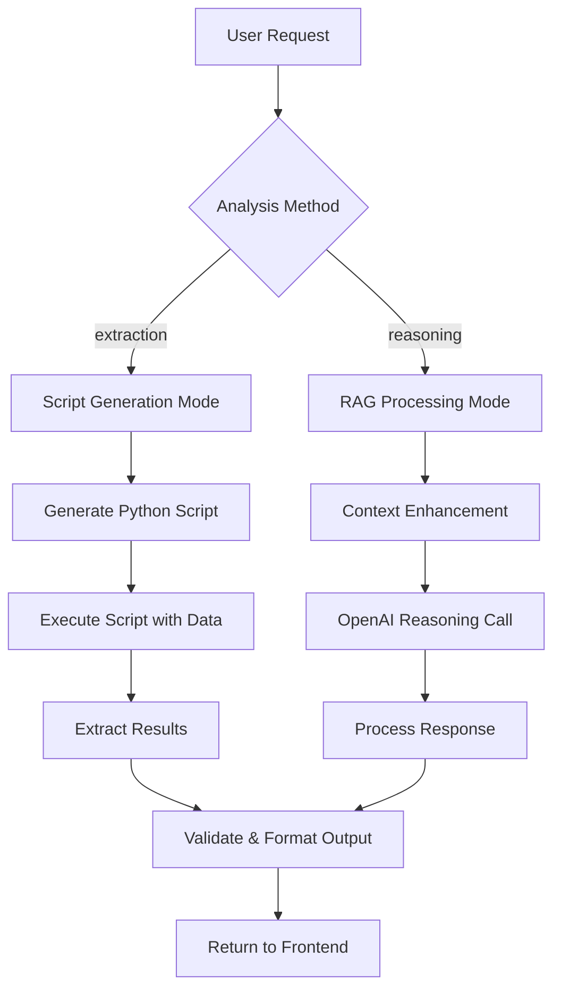
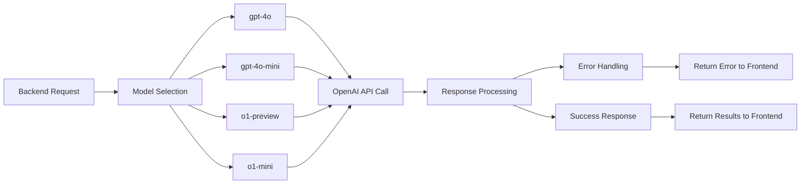
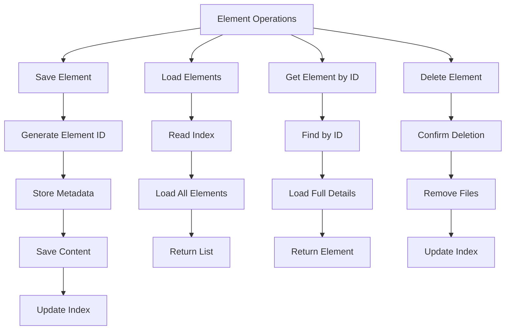
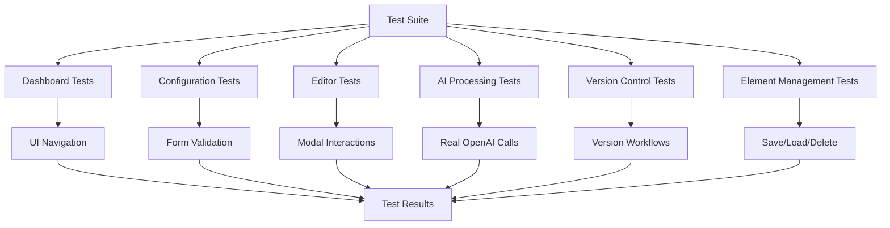
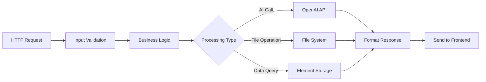
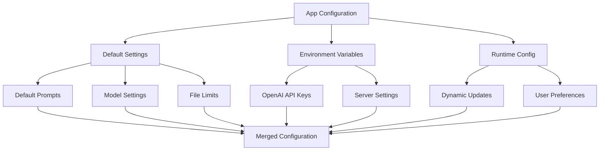
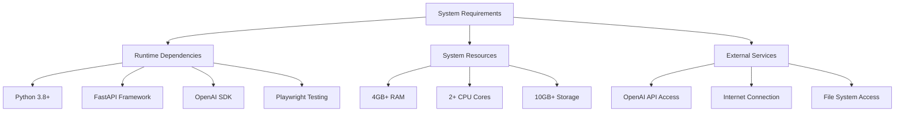

# ⚙️ Backend Functionality Overview

## System Architecture Flow



---

## 📡 API Endpoint Flow

```mermaid
graph LR
    A[Frontend Request] --> B[FastAPI Router]
    
    B --> C[/api/config - GET/POST]
    B --> D[/api/process-config - POST]
    B --> E[/api/chat/iterate - POST]
    B --> F[/api/elements/* - GET/POST/DELETE]
    B --> G[/static/* - Static Files]
    
    C --> H[Configuration Management]
    D --> I[AI Processing]
    E --> J[Chat Iterations]
    F --> K[Element CRUD]
```

**Core Endpoints:**
- **Configuration**: Load/save app settings
- **AI Processing**: Main analysis endpoint
- **Chat Iteration**: Conversational refinement
- **Elements**: Save, load, delete results
- **Static Files**: Serve UI assets

---

## 🤖 AI Processing Flow



**Processing Steps:**
1. **Request Analysis**: Parse user prompt and method
2. **Script Generation**: Create custom Python code for extraction
3. **Execution**: Run script against data files
4. **Result Processing**: Format and validate output
5. **Response**: Send results back to frontend

### **Current JSON Schema (test_config.json)**

The system processes requests using this exact JSON structure:

```json
{
  "user_prompt": "How many complaints are for Israel? Please provide a detailed list with all of them.",
  "method": "extraction",
  "model": "gpt-4o-mini",
  "data": [],
  "files": [
    {
      "file_name": "test",
      "file_type": "TXT",
      "file_path": "test.txt"
    }
  ]
}
```

**Schema Fields:**
- **user_prompt**: The analysis question/request
- **method**: "extraction" or "reasoning"
- **model**: OpenAI model selection
- **data**: Additional data context (currently unused)
- **files**: Array of files to process

---

## 🔄 OpenAI Integration Flow



**Model Usage:**
- **gpt-4o/gpt-4o-mini**: General analysis and script generation
- **o1-preview/o1-mini**: Advanced reasoning tasks
- **Error Handling**: Graceful failure with user feedback
- **Response Processing**: Format results for frontend

---

## 💾 Element Management Flow



**Storage Structure:**
- **Element ID**: Unique identifier generation
- **Metadata**: Name, version, timestamps
- **Content**: Full AI output and context
- **Indexing**: Fast retrieval system

---

## 🧪 Playwright Testing Flow



**Test Coverage:**
- **End-to-End**: Complete user workflows
- **Integration**: API and OpenAI testing
- **UI Testing**: Modal and form interactions
- **Real Data**: Actual AI processing with test files

---

## 📊 Request Processing Flow



**Processing Pipeline:**
- **Validation**: Input sanitization and checks
- **Routing**: Direct to appropriate handler
- **External Calls**: OpenAI, file system, storage
- **Response**: Formatted JSON back to frontend

---

## 🔧 Configuration Management Flow



**Configuration Sources:**
- **Defaults**: Built-in application settings
- **Environment**: API keys and deployment config
- **Runtime**: Dynamic user preferences
- **Validation**: Ensure all required settings present

---

## 🚀 System Requirements



**Key Dependencies:**
- **Backend**: FastAPI, OpenAI SDK, Pydantic
- **Testing**: Playwright for end-to-end testing
- **Resources**: Moderate hardware requirements
- **External**: OpenAI API key required

The backend provides a robust foundation for AI-powered document analysis with comprehensive testing and reliable processing pipelines.