# 🔄 Frontend-Backend Communication

## System Integration Overview

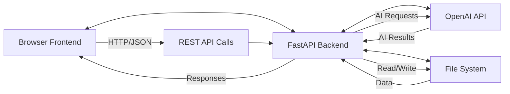

---

## 🌐 Communication Architecture

### **High-Level Data Flow**
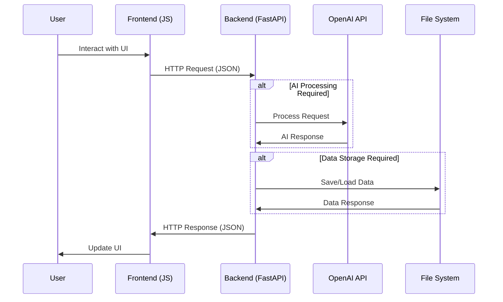

---

## 📡 API Communication Patterns

### **Request-Response Flow**

```mermaid
graph TD
    A[User Action] --> B[JavaScript Function]
    
    B --> C[Collect Form Data]
    B --> D[Validate Input]
    B --> E[Show Loading State]
    B --> F[Make fetch() Call]
    
    C --> G[HTTP Request]
    D --> G
    E --> G
    F --> G
    
    G --> H[Method: POST/GET/DELETE]
    G --> I[Headers: Content-Type]
    G --> J[Body: JSON Payload]
    
    H --> K[Backend FastAPI]
    I --> K
    J --> K
    
    K --> L[Endpoint Handler]
    L --> M[Validate Request Data]
    L --> N[Process Business Logic]
    L --> O[External API Calls]
    L --> P[Save/Load Data]
    L --> Q[Return JSON Response]
    
    M --> R[HTTP Response]
    N --> R
    O --> R
    P --> R
    Q --> R
    
    R --> S[Status: 200/400/500]
    R --> T[Headers: Content-Type]
    R --> U[Body: JSON Data]
    
    S --> V[Frontend Processing]
    T --> V
    U --> V
    
    V --> W[Parse JSON Response]
    V --> X[Handle Success/Error]
    V --> Y[Update UI State]
    V --> Z[Show User Feedback]
```

---

## 🔄 Core Communication Flows

### **1. Configuration & AI Processing**
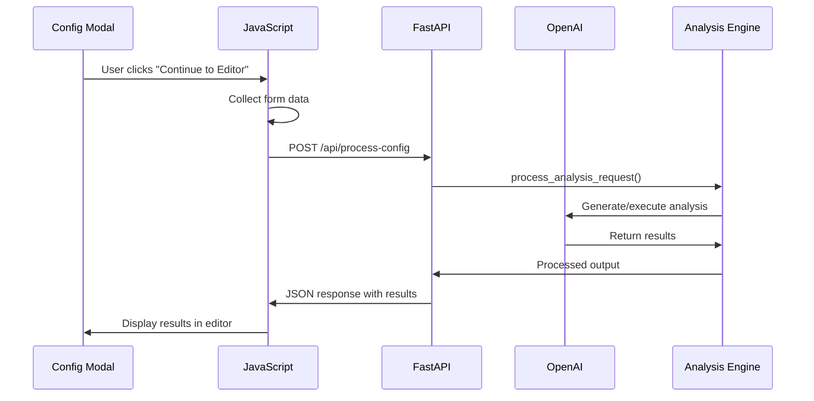

### **2. Element Management**
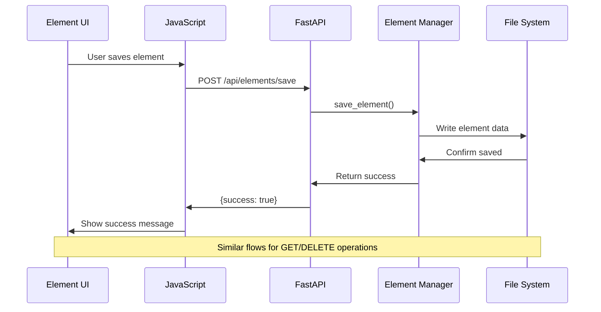

### **3. Chat Iteration**
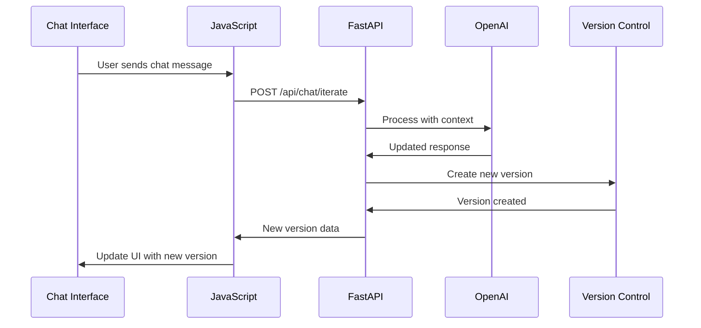

---

## 📊 Data Formats & Structures

### **Configuration Request**
```json
{
    "user_prompt": "How many complaints are for Israel?",
    "method": "extraction",
    "model": "gpt-4o",
    "files": [
        {
            "file_name": "test.txt",
            "file_type": "TXT", 
            "file_path": "test.txt"
        }
    ],
    "document_sources": [],
    "referenced_elements": ["kpi-table"]
}
```

### **AI Processing Response**
```json
{
    "success": true,
    "result": "Number of complaints for Israel: 14\nDetailed list...",
    "user_prompt": "How many complaints are for Israel?",
    "method": "extraction",
    "model": "gpt-4o",
    "processing_time": 12.5,
    "metadata": {
        "script_generated": true,
        "execution_successful": true
    }
}
```

### **Element Save Request**
```json
{
    "element_id": "element_1756075221594_jnli4rvwa",
    "element_name": "Israel Complaints Analysis",
    "saved_version": 1,
    "output": "Number of complaints for Israel: 14...",
    "full_chat_history": ["How many complaints..."],
    "context_used": "How many complaints are for Israel?",
    "created_at": "2025-01-24T22:40:51.594Z",
    "saved_at": "2025-01-24T22:41:15.123Z",
    "all_versions": [
        {
            "version": 1,
            "locked": true,
            "timestamp": "2025-01-24T22:40:51.594Z"
        }
    ]
}
```

---

## ⚡ Real-Time Interaction Patterns

### **Loading States Management**
```javascript
// Frontend Loading Pattern
async function processConfiguration() {
    const continueBtn = document.getElementById('continue-btn');
    
    try {
        // 1. Show loading state
        continueBtn.disabled = true;
        continueBtn.textContent = 'Processing...';
        showLoadingInPreview();
        
        // 2. Make API call
        const response = await fetch('/api/process-config', {
            method: 'POST',
            headers: {'Content-Type': 'application/json'},
            body: JSON.stringify(configData)
        });
        
        const result = await response.json();
        
        // 3. Handle response
        if (result.success) {
            displayAIResult(result);
            openEditorModal();
        } else {
            throw new Error(result.detail);
        }
        
    } catch (error) {
        // 4. Error handling
        showAlert('Error: ' + error.message, 'error');
    } finally {
        // 5. Reset UI state
        continueBtn.disabled = false;
        continueBtn.textContent = 'Continue to Editor';
    }
}
```

### **Error Propagation**

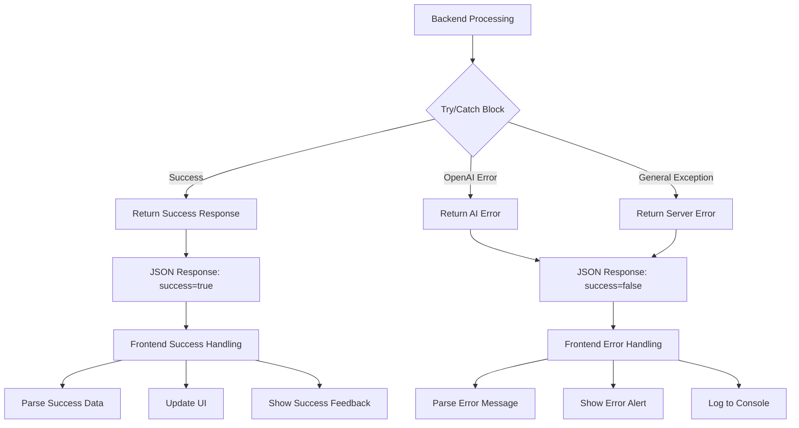

---

## 🔐 Authentication & Security Flow

### **Current Implementation** 

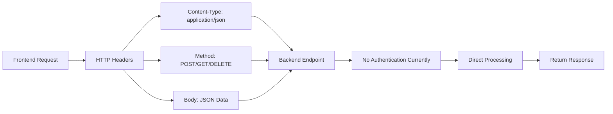

### **Future Authentication Flow**
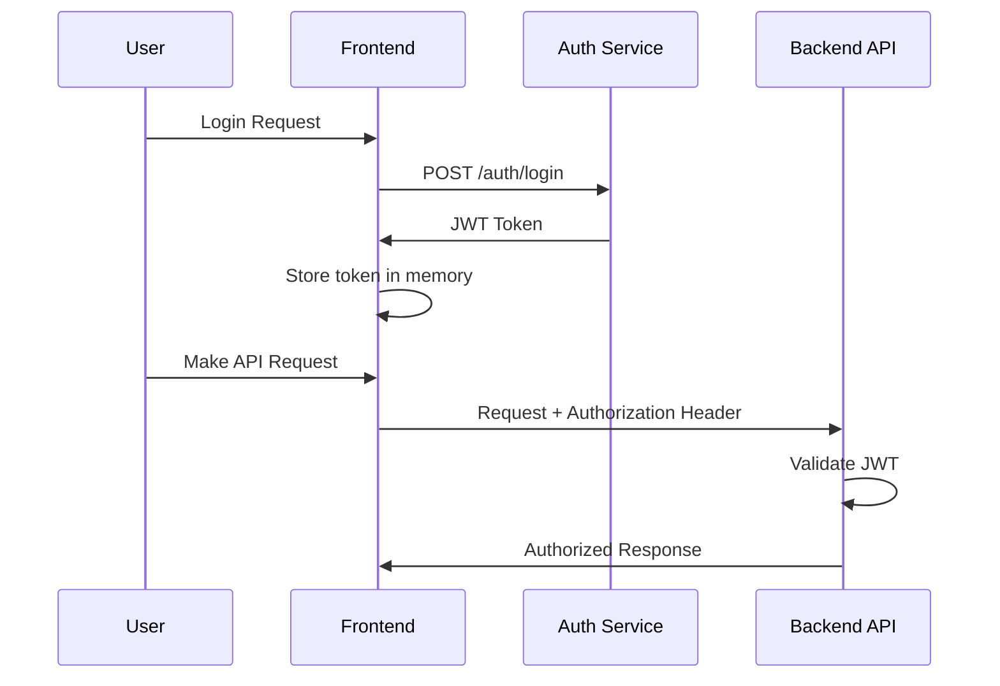

---

## 📈 Performance Optimization

### **Request Optimization Strategies**

#### **1. Batch Operations**
```javascript
// Instead of multiple individual requests
const elements = await Promise.all([
    fetch('/api/elements/1'),
    fetch('/api/elements/2'), 
    fetch('/api/elements/3')
]);

// Use batch endpoint (future enhancement)
const elements = await fetch('/api/elements/batch', {
    method: 'POST',
    body: JSON.stringify({ids: [1, 2, 3]})
});
```

#### **2. Caching Strategy**

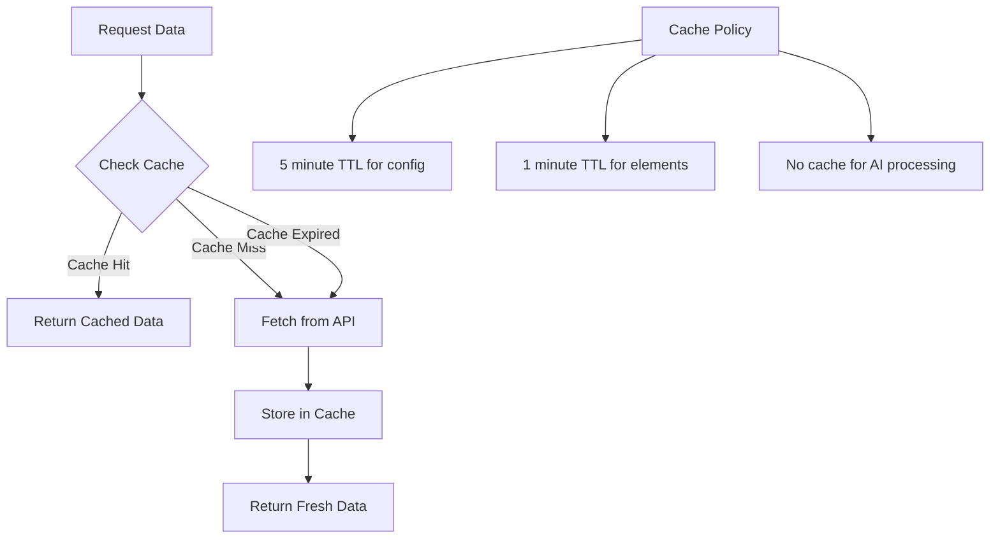

#### **3. Progressive Loading**
```javascript
// Load dashboard data progressively
async function loadDashboard() {
    // 1. Load critical UI first
    showDashboardSkeleton();
    
    // 2. Load configuration (fast)
    const config = await loadConfiguration();
    updateConfigUI(config);
    
    // 3. Load saved elements (slower)
    const elements = await loadSavedElements();
    updateElementsGrid(elements);
    
    // 4. Hide skeleton
    hideDashboardSkeleton();
}
```

---

## 🔧 Development & Debugging

### **API Development Workflow**
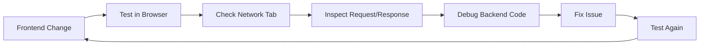

### **Common Debugging Points**

```mermaid
graph TB
    A[Debugging Strategy] --> B[Frontend Debugging]
    A --> C[Backend Debugging]
    
    B --> D[Browser Console]
    B --> E[Network Tab]
    
    D --> F[JavaScript Errors]
    D --> G[Network Requests]
    D --> H[Response Data]
    
    E --> I[Request Headers]
    E --> J[Request Payload]
    E --> K[Response Status]
    E --> L[Response Time]
    
    C --> M[FastAPI Logs]
    C --> N[Custom Logging]
    
    M --> O[Request Processing]
    M --> P[AI API Calls]
    M --> Q[Error Traces]
    
    N --> R[print() Statements]
    N --> S[logging.debug()]
    N --> T[Request Timing]
```

---

## 🚀 Deployment Communication

### **Development Environment**

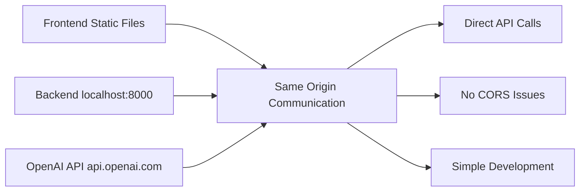

### **Production Environment (Future)**

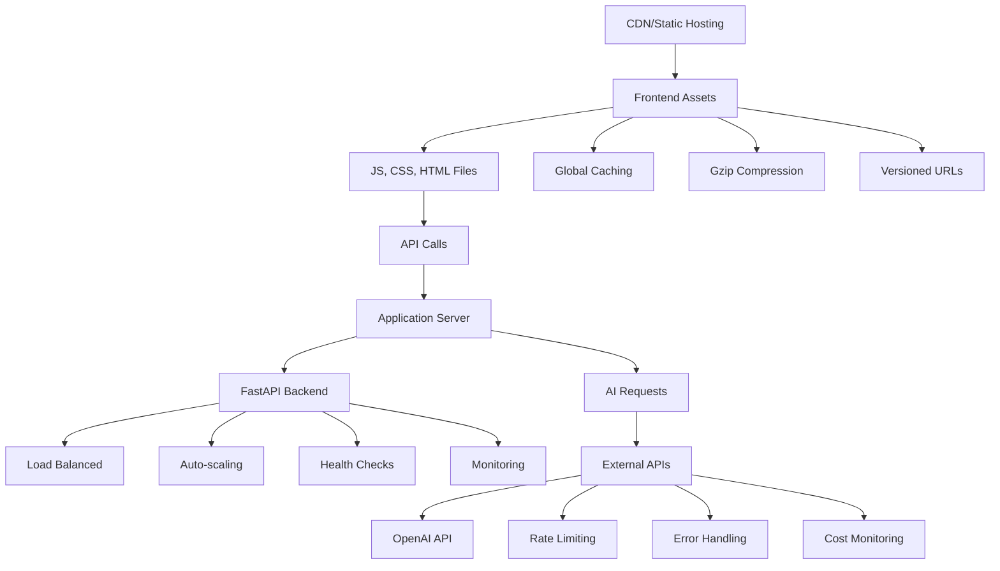

---

## 📋 Integration Testing

### **End-to-End Communication Test**
```javascript
// Playwright E2E Test Example
test('Complete AI processing workflow', async ({ page }) => {
    // 1. Frontend interaction
    await page.goto('/');
    await page.click('.feature-card');
    
    // 2. API communication verification
    const configResponse = page.waitForResponse('/api/process-config');
    await page.click('#continue-btn');
    
    // 3. Verify backend processing
    const response = await configResponse;
    expect(response.status()).toBe(200);
    
    const data = await response.json();
    expect(data.success).toBe(true);
    
    // 4. Verify frontend update
    await expect(page.locator('.preview-result')).toBeVisible();
    await expect(page.locator('#version-text')).toContainText('Version 1');
});
```

This comprehensive documentation provides a clear overview of how the frontend and backend communicate, making it easy to understand the system's integration points and data flow patterns! 🎯